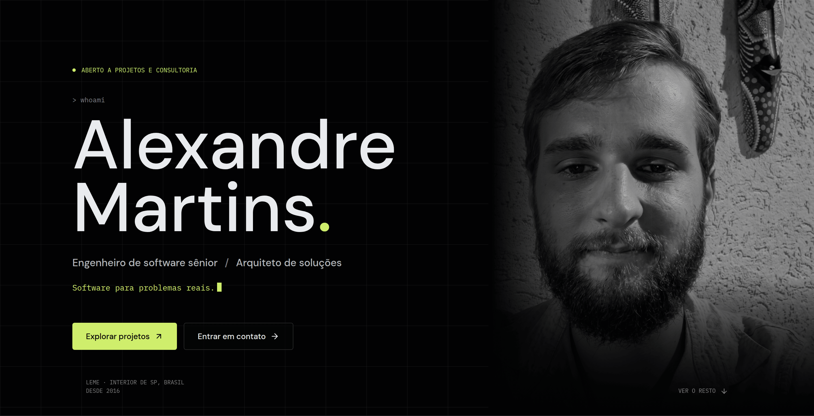
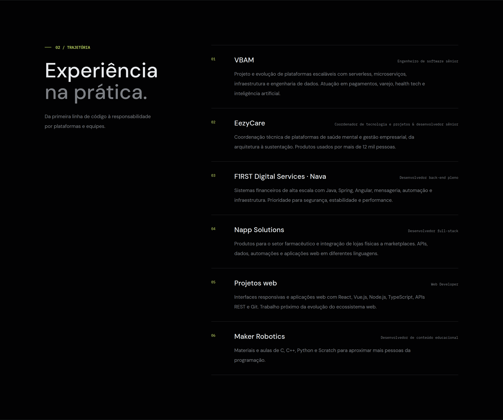
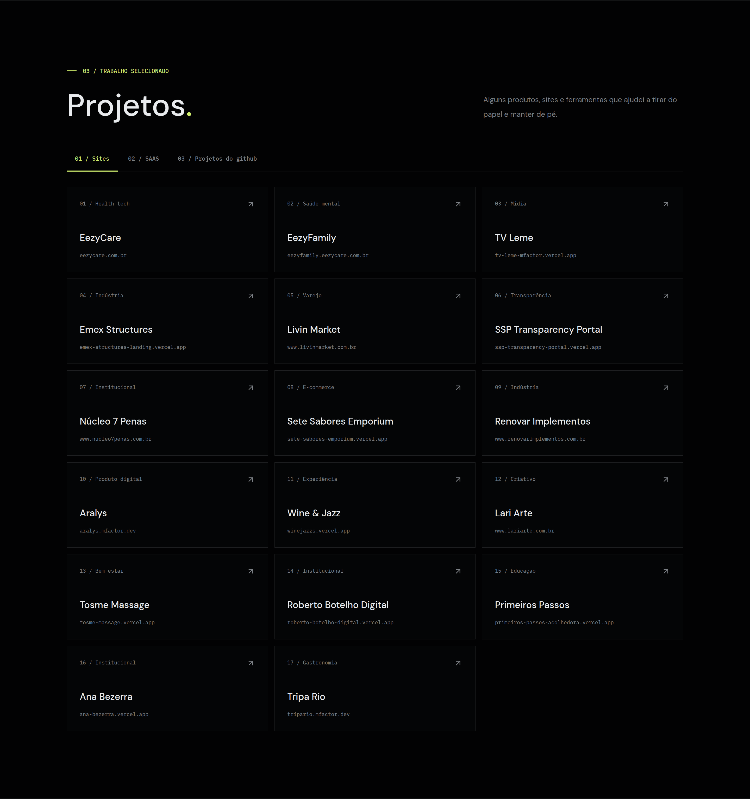
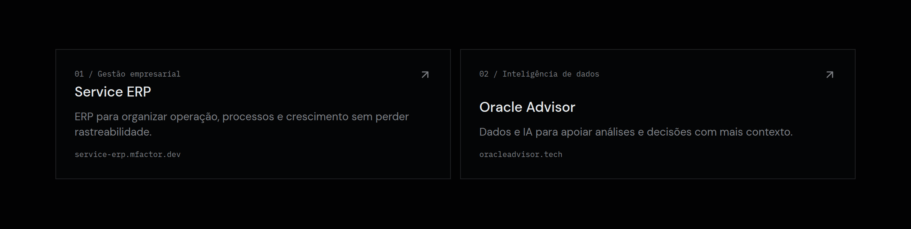
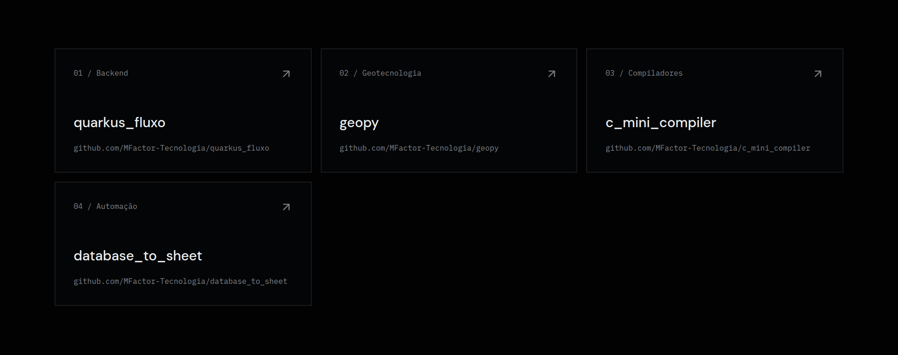
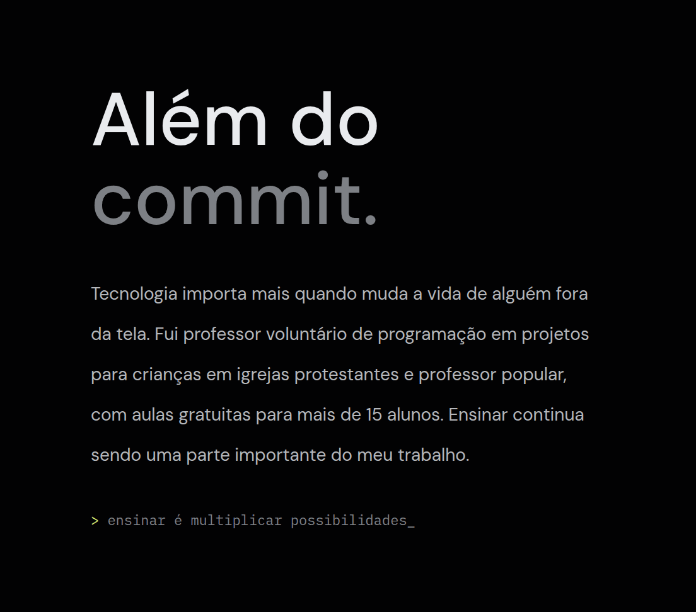
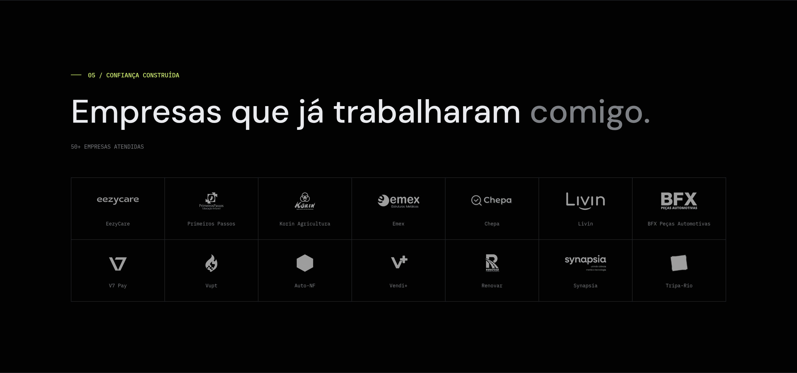
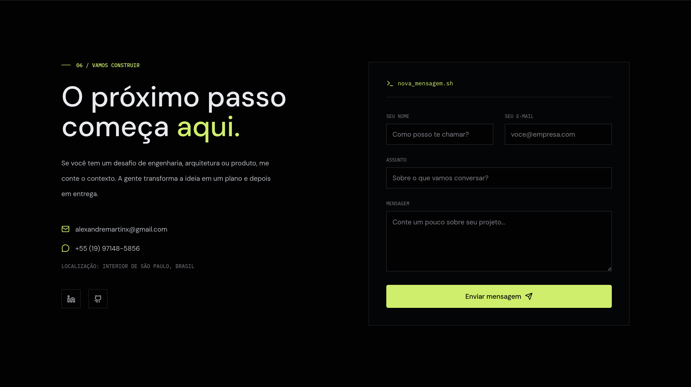

 
 

 

 

 

| # | Categoria | Projeto |
| :-- | :-- | :-- |
| 01 | Health tech | [EezyCare](https://eezycare.com.br) |
| 02 | Saúde mental | [EezyFamily](https://eezyfamily.eezycare.com.br/) |
| 03 | Mídia | [TV Leme](https://tv-leme-mfactor.vercel.app/) |
| 04 | Indústria | [Emex Structures](https://emex-structures-landing.vercel.app/) |
| 05 | Varejo | [Livin Market](https://www.livinmarket.com.br/) |
| 06 | Transparência | [SSP Transparency Portal](https://ssp-transparency-portal.vercel.app/) |
| 07 | Institucional | [Núcleo 7 Penas](https://www.nucleo7penas.com.br/) |
| 08 | E-commerce | [Sete Sabores Emporium](https://sete-sabores-emporium.vercel.app/) |
| 09 | Indústria | [Renovar Implementos](https://www.renovarimplementos.com.br/) |
| 10 | Produto digital | [Aralys](https://aralys.mfactor.dev/) |
| 11 | Experiência | [Wine & Jazz](https://winejazzs.vercel.app/) |
| 12 | Criativo | [Lari Arte](https://www.lariarte.com.br/) |
| 13 | Bem-estar | [Tosme Massage](https://tosme-massage.vercel.app/) |
| 14 | Institucional | [Roberto Botelho Digital](https://roberto-botelho-digital.vercel.app/) |
| 15 | Educação | [Primeiros Passos](https://primeiros-passos-acolhedora.vercel.app/) |
| 16 | Institucional | [Ana Bezerra](https://ana-bezerra.vercel.app/) |
| 17 | Gastronomia | [Tripa Rio](https://tripario.mfactor.dev/) |

### 02 / SaaS

| Produto | Categoria | Contexto |
| :-- | :-- | :-- |
| [**Service ERP**](https://service-erp.mfactor.dev/) | Gestão empresarial | ERP para organizar operação, processos e crescimento sem perder rastreabilidade. |
| [**Oracle Advisor**](https://oracleadvisor.tech/) | Inteligência de dados | Dados e IA para apoiar análises e decisões com mais contexto. |

### 03 / Projetos do GitHub

| Repositório | Categoria |
| :-- | :-- |
| [MFactor-Tecnologia/quarkus_fluxo](https://github.com/MFactor-Tecnologia/quarkus_fluxo) | Backend |
| [MFactor-Tecnologia/geopy](https://github.com/MFactor-Tecnologia/geopy) | Geotecnologia |
| [MFactor-Tecnologia/c_mini_compiler](https://github.com/MFactor-Tecnologia/c_mini_compiler) | Compiladores |
| [MFactor-Tecnologia/database_to_sheet](https://github.com/MFactor-Tecnologia/database_to_sheet) | Automação |

 

  

  

FONTE: GITHUB · ATUALIZAÇÃO AUTOMÁTICA · mesma base pública do calendário anual de contribuições usado no site.

 
 

 

 
 

  
    <a href="mailto:alexandremartinx@gmail.com">alexandremartinx@gmail.com</a> ·
    <a href="https://wa.me/5519971485856">+55 (19) 97148-5856</a> ·
    <a href="https://www.alexandremartins.dev/">alexandremartins.dev</a>
     
    <code>&gt;_ alexandre.martins</code> · Engenharia para problemas reais · Feito em Leme, SP
  

